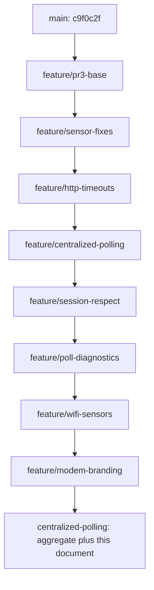

# Feature packages and review bases

These branches preserve the existing commits and form a stack. Each package is
reviewed against its listed base, **not against main**: comparing every branch
to main would include all preceding packages. No history has been rewritten.

| Package branch | Review base | Package commit(s) | Scope |
|---|---|---|---|
| `feature/pr3-base` | `main` at `c9f0c2f` | `47b51ea` through `3ecfd84` | Original PR #3: DOCSIS, WAN/LAN and login recovery |
| `feature/sensor-fixes` | `feature/pr3-base` | `db20489` | Locked-channel filtering, counter state classes, availability |
| `feature/http-timeouts` | `feature/sensor-fixes` | `25fe2d3` | Connect/read timeouts for HTTP requests |
| `feature/centralized-polling` | `feature/http-timeouts` | `1a115c5` | Shared snapshots, serialized polling, unload handling, tests |
| `feature/session-respect` | `feature/centralized-polling` | `c1ee9ec` | Never force an existing router session out |
| `feature/poll-diagnostics` | `feature/session-respect` | `b55ea9a` | System attributes and typed login/session errors |
| `feature/wifi-sensors` | `feature/poll-diagnostics` | `950ebd3` | One WiFi fetch, two radio sensors, partial-failure diagnostics |
| `feature/modem-branding` | `feature/wifi-sensors` | `44e25a1` | Local icon and logo |



## Technical dependencies versus stack order

- Sensor fixes target the new PR #3 sensors.
- HTTP timeouts can be extracted independently of the sensor fixes, but use the
  PR's updated HTTP/login code.
- Central polling consumes the existing sensor groups and assumes finite HTTP
  timeouts so shutdown is not left waiting indefinitely on a silent router.
- Session respect modifies login, not the central poller. It can be extracted
  onto the PR base if needed; its current commit also documents central polling.
- Poll diagnostics depend on the central poller and the revised login errors.
- WiFi uses the central poller and its diagnostic handling; it is not a standalone
  addition to the original PR sensor implementation.
- Branding has no Python dependency. Its commit can be cherry-picked separately;
  local integration branding requires Home Assistant 2026.3 or later. Its position
  at the end of this stack is historical, not a runtime dependency on WiFi.

## Shared test state and publication

`centralized-polling` remains the aggregate branch containing all packages.
The older `local-integration` branch remains at `25fe2d3` (PR, sensor fixes and
HTTP timeouts); it does **not** contain the later features. Older local branches
are retained as checkpoints.

Example focused review:

```sh
git diff feature/session-respect...feature/poll-diagnostics
```

If a lower package changes, its dependent branches must be updated deliberately;
branches do not follow each other automatically. No force-push is needed for
this initial split. No new PR, merge into main, or prerelease is created by this
packaging step. Those remain subject to explicit approval.
